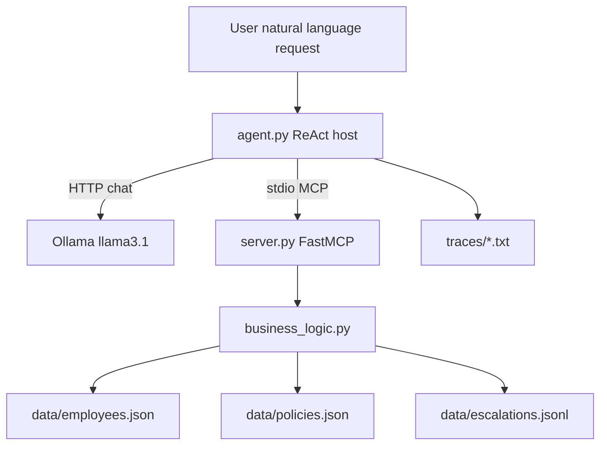
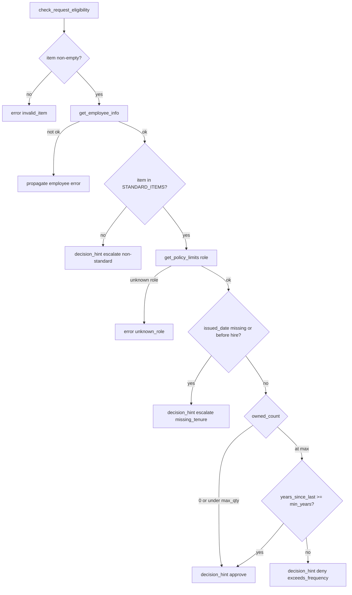
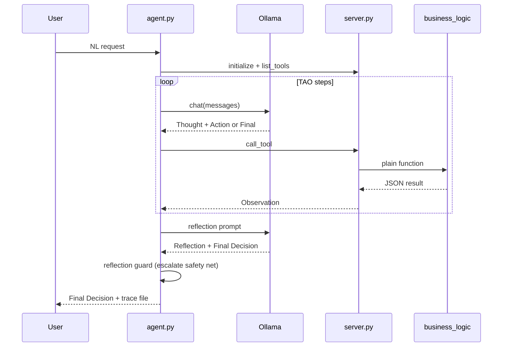

# Architecture — IT Equipment MCP Lab

Granular walkthrough of how this project is layered, how a request moves through the system, and which file owns each step.

Policy rules live in [`docs/requirements.md`](requirements.md). This document explains **runtime structure and control flow**.

---

## 1. Big picture

The system answers one question:

> Given a natural-language equipment request, should IT **approve**, **deny**, or **escalate**?

It is built as four layers that stay deliberately separate:

| Layer | Files | Job |
|---|---|---|
| Policy data | `data/employees.json`, `data/policies.json` | Mock DB: who owns what, role limits |
| Pure logic | `business_logic.py` | Deterministic eligibility + `evaluate_request` (no MCP, no LLM) |
| MCP server | `server.py` | Expose logic as tools over **stdio** |
| Agent host | `agent.py`, `prompts.py`, `llm.py` | ReAct loop: call tools via MCP client, draft, reflect |



**Design rule:** inventory math and catalog rules are deterministic in Python. The LLM’s job is to extract who/what/why, choose tools, and draft prose — not invent issue dates or policy numbers.

---

## 2. Repository map

```
w7_mcp/
  docs/
    requirements.md          # Phase 1: schema, limits, escalate rules, fixtures
    architecture.md          # this file
    submission_assets/       # handshake / CI screenshots for the PDF packet
  data/
    employees.json           # EMP-101…105 (+ absent EMP-999 for tests)
    policies.json            # role × item {max_qty, min_years}
    escalations.jsonl        # append-only side effect of flag_for_human_review
  business_logic.py          # plain functions (unit-tested)
  test_business_logic.py     # pytest; also what CI runs
  server.py                  # FastMCP stdio server
  test_client.py             # MCP client smoke (handshake + optional --all-tools)
  agent.py                   # ReAct agent + reflection + trace writer
  prompts.py                 # system + reflection prompt text
  llm.py                     # Ollama /api/chat wrapper
  run_scenarios.py           # graded approve/deny/escalate runner
  assemble_submission.py     # Markdown/PDF packet builder
  traces/scenarios/          # curated evidence traces
  .github/workflows/ci.yml   # pytest only (no Ollama)
```

Build order (assignment “Suggested Approach”):

1. Requirements doc  
2. Plain functions + unit tests  
3. One-tool / full MCP server + client handshake  
4. Agent (hardcoded tool call → full ReAct)  
5. Reflection  
6. Four scenario traces  
7. CI + submission packet  

---

## 3. Data layer

### 3.1 Employees (`data/employees.json`)

Keyed by `EMP-###`. Each record has:

- `employee_id`, `name`, `role`, `hire_date`
- `inventory[]` of `{item, issued_date, asset_tag}`

Seeded fixtures (fixed “today” = **2026-10-02** via `REFERENCE_TODAY` in `business_logic.py`):

| ID | Role | Purpose |
|---|---|---|
| EMP-101 | Engineering | laptop 2022-09-01 → **approve** (≥ 3 years) |
| EMP-102 | Sales | laptop 2026-04-01 → **deny** (~6 months, no damage) |
| EMP-103 | Engineering | laptop 2025-10-01 → **escalate** if damage phrases present |
| EMP-104 | Management | 1 monitor; used for non-standard / qty cases |
| EMP-105 | Engineering | missing `issued_date` → tenure escalate |
| EMP-999 | — | not in DB → not-found error |

### 3.2 Policies (`data/policies.json`)

- `standard_items`: `laptop`, `monitor`, `ergonomic_chair`
- `roles.<Role>.<item>` → `{max_qty, min_years}`

Anything not in `standard_items` is non-standard → escalate path.

### 3.3 Escalation queue

`flag_for_human_review` writes:

1. In-memory `ESCALATION_QUEUE` (process lifetime)
2. Append line to `data/escalations.jsonl`

Tests call `clear_escalation_queue(truncate_file=True)` so runs stay isolated.

---

## 4. Business logic layer (`business_logic.py`)

No MCP imports. Every tool’s “real work” lives here so pytest can call it directly.

### 4.1 Function surface

| Function | Input | Output idea |
|---|---|---|
| `get_employee_info` | `employee_id` | role, hire_date, inventory — or structured error |
| `find_employee` | `name`, optional `role` | resolve `EMP-###` when the user only gives a name |
| `get_policy_limits` | `role` | per-item max_qty / min_years |
| `check_request_eligibility` | `employee_id`, `item` | eligibility **hints** (does **not** read free-text reason) |
| `evaluate_request` | `employee_id`, `item`, `reason` | authoritative `{decision, rule}` |
| `flag_for_human_review` | `employee_id`, `request`, `reason` | queue + JSONL confirmation |

### 4.2 `check_request_eligibility` decision tree



Important: when frequency is exceeded, eligibility returns `decision_hint=deny` and `exceeds_frequency=true`. It does **not** look at damage phrases. That upgrade happens in `evaluate_request`.

### 4.3 `evaluate_request` (authoritative decision)

```text
evaluate_request(employee_id, item, reason)
  1. reject empty reason
  2. eligibility = check_request_eligibility(...)
  3. if eligibility failed → decision=escalate, rule=<error code>
  4. if decision_hint == approve → decision=approve, rule=within_policy
  5. if decision_hint == escalate → rule=non_standard_item | missing_tenure | ...
  6. if exceeds_frequency AND has_exceptional_justification(reason)
       → decision=escalate, rule=early_refresh_exceptional
  7. else → decision=deny, rule=exceeds_frequency
```

Exceptional phrases (`EXCEPTIONAL_PHRASES`):

`damaged`, `crushed`, `stolen`, `broken screen`, `client site`

Stable rule ids you will see in tests / traces:

| rule | meaning |
|---|---|
| `within_policy` | approve |
| `exceeds_frequency` | deny (no exceptional reason) |
| `early_refresh_exceptional` | escalate (early + damage phrases) |
| `non_standard_item` | escalate |
| `missing_tenure` | escalate |
| `employee_not_found` | escalate / lookup failure |

### 4.4 Why two steps (eligibility vs evaluate)?

- **Eligibility** = pure inventory/policy math (easy to unit test, reusable).
- **Evaluate** = math + free-text exceptional rules → one final `decision` the agent should copy.

---

## 5. MCP server layer (`server.py`)

### 5.1 Transport

- Framework: FastMCP (`mcp.server.fastmcp`)
- Server name: `IT-Equipment-Server`
- Transport: **stdio** (parent process spawns `python server.py` and talks JSON-RPC on stdin/stdout)

There is no HTTP API for tools. The agent (or `test_client.py`) is always the MCP client.

### 5.2 Tools registered today

Thin wrappers: each `@mcp.tool()` calls the matching `business_logic` function and returns its dict.

| MCP tool | Wraps |
|---|---|
| `get_employee_info` | `bl.get_employee_info` |
| `find_employee` | `bl.find_employee` |
| `get_policy_limits` | `bl.get_policy_limits` |
| `check_request_eligibility` | `bl.check_request_eligibility` |
| `evaluate_request` | `bl.evaluate_request` (authoritative `{decision, rule}`) |
| `flag_for_human_review` | `bl.flag_for_human_review` |

The agent copies `evaluate_request.decision`, emits a `[ROUTE]` line after that tool returns, and applies a decision lock if reflection drifts away from the tool outcome.

### 5.3 Client handshake (`test_client.py`)

```text
spawn server.py (stdio)
  → session.initialize()
  → list_tools()          # prove registration
  → call_tool(get_employee_info, EMP-101)
  → optional --all-tools smoke for the rest
```

This is the plumbing proof before trusting the agent.

---

## 6. Agent layer (Planner → TAO → Reflector)

Files: `agent.py` (orchestration), `prompts.py` (instructions), `llm.py` (Ollama).

### 6.1 Startup sequence (`run_agent`)

```text
1. StdioServerParameters(command=python, args=[server.py])
2. stdio_client → ClientSession.initialize()
3. list_tools() → build_system_prompt(tools)   # Planner: rules + tool schemas
4. messages = [system, user_prompt]
5. TAO loop (max AGENT_MAX_STEPS, default 8)
6. optional inject_draft (for reflection demo)
7. Reflection pass (second Ollama call)
8. write trace file under traces/
9. return {decision, reason, tools_called, ...}
```

### 6.2 LLM I/O (`llm.py`)

- `POST {OLLAMA_HOST}/api/chat`
- Default model: `llama3.1:8b`
- ReAct turns: `temperature=0.1`
- Reflection: `temperature=0.0`
- Env: `OLLAMA_HOST`, `OLLAMA_MODEL`, `OLLAMA_TIMEOUT_S`

### 6.3 Planner (system prompt)

`prompts.build_system_prompt(tools)` concatenates:

1. Decision rules (approve / deny / escalate + when to flag)
2. Preferred tool order: `(find_employee?) → get_employee_info → check_request_eligibility → Final Decision`
3. Live tool schemas from MCP `list_tools`

The model is told:

- Role from the employee **record** wins over user text
- Never invent dates / policy numbers
- Final Decision is **not** a tool (must not appear inside `Action` JSON)

### 6.4 TAO loop (Thought → Action → Observation)

Each step:

```text
assistant = llm.chat(messages)
parsed = parse_assistant(assistant)   # regex: Thought / Action JSON / Final Decision

if invalid:
  one PARSE_RETRY_HINT, then escalate if still broken
if final:
  capture Draft Final Decision / Reason → break
if action:
  if unknown tool name → observation error (e.g. tool "deny" is illegal)
  else session.call_tool(tool, arguments)
       append Observation to messages + trace
```

**Parsing** (`parse_assistant`):

- `Thought:` … until next keyword  
- `Action: {"tool": "...", "arguments": {...}}`  
- or `Final Decision: approve|deny|escalate` + `Reason:`

Conversation grows as:

```text
system
user (request)
assistant (Thought/Action)
user (Observation from <tool>: ...)
assistant ...
...
assistant (Final Decision)
```

### 6.5 How the agent reaches approve / deny / escalate (current `main`)



Typical tool path:

1. `find_employee` — only if no `EMP-###`
2. `get_employee_info` — authoritative role + inventory
3. `get_policy_limits` — optional diagnostic
4. `check_request_eligibility` — `decision_hint` / `exceeds_frequency`
5. If escalate case → `flag_for_human_review` **before** Final Decision
6. Draft Final Decision

Exceptional early-refresh (EMP-103): eligibility says **deny**, but the prompt tells the model that damage phrases → call `flag_for_human_review` then escalate. If reflection wrongly flips to deny after a flag, the **reflection guard** in `agent.py` snaps back to escalate.

### 6.6 Reflection

`run_reflection`:

1. Format `REFLECTION_PROMPT` with user request, draft, and concatenated tool observations
2. Second `llm.chat` call
3. Parse `Reflection:` + `Final Decision:` + `Reason:`
4. Log draft → reflected outcome
5. Apply escalate guard when `flag_for_human_review` was already called

`run_scenarios.py` can `--inject-draft` a bad deny to prove correction (`traces/scenarios/00_reflection_correction.txt`).

### 6.7 Trace output

`_save_trace` writes a text file with:

- header: prompt, model, host, decision, draft_decision, reflection on/off, optional scenario id
- body: user request, tools list, each Step (Thought/Action/Observation), Reflection blocks, Final Decision

Ad-hoc runs → `traces/<timestamp>_<slug>.txt`  
Graded runs → `traces/scenarios/0x_*.txt`

---

## 7. End-to-end request walks

### 7.1 Clear approve (EMP-101)

```text
"EMP-101: laptop ~4 years old, slowing down"
  → get_employee_info(EMP-101)
      inventory laptop issued 2022-09-01
  → check_request_eligibility(EMP-101, laptop)
      years_since_last ≈ 4.08 ≥ 3 → decision_hint=approve
  → Final Decision: approve
  → Reflection confirms
  → no flag_for_human_review
```

### 7.2 Clear deny (EMP-102)

```text
"EMP-102: Sales laptop ~6 months, slow, no damage"
  → eligibility: exceeds_frequency, decision_hint=deny
  → no exceptional phrases
  → Final Decision: deny
  → must not call flag_for_human_review
```

### 7.3 Escalate A — early + damage (EMP-103)

```text
"EMP-103: crushed / stolen / broken screen, early replacement"
  → eligibility: exceeds_frequency, decision_hint=deny
  → model sees exceptional phrases in user text
  → flag_for_human_review(...)
  → Final Decision: escalate
  → (evaluate_request would return rule=early_refresh_exceptional)
```

### 7.4 Escalate B — non-standard (EMP-104)

```text
"EMP-104: ergonomic split keyboard / standing desk"
  → eligibility: decision_hint=escalate (not in STANDARD_ITEMS)
  → flag_for_human_review(...)
  → Final Decision: escalate
```

### 7.5 Same cases via `evaluate_request` (unit-test / future MCP path)

| Case | `evaluate_request` result |
|---|---|
| EMP-101 laptop + “slow” | `approve` / `within_policy` |
| EMP-102 laptop + “slow” | `deny` / `exceeds_frequency` |
| EMP-103 laptop + “broken screen” | `escalate` / `early_refresh_exceptional` |
| EMP-101 `standing_desk` | `escalate` / `non_standard_item` |

---

## 8. Scenario runner & CI

### 8.1 `run_scenarios.py`

For each graded case:

1. Clear escalation queue  
2. `run_agent(prompt, enable_reflection=True, trace_path=...)`  
3. Assert expected decision + required/forbidden tools  
4. Retry with a hint prompt up to 3 times if the LLM drifts  

Also runs the reflection correction demo first.

### 8.2 CI (`.github/workflows/ci.yml`)

On push/PR:

```text
checkout → Python 3.11 → pip install -r requirements.txt
→ pytest test_business_logic.py -v
```

Intentionally **no** Ollama, no live MCP smoke in CI. Agent quality is evidenced by committed traces + local runs.

### 8.3 Submission packet (`assemble_submission.py`)

Stitches, in assignment order:

1. Requirements doc  
2. Handshake evidence  
3. Server code  
4. Unit tests + pytest log  
5. Agent / llm / prompts  
6. Four scenario traces  
7. Reflection correction log  
8. CI evidence  

Output: `submission/IT_Equipment_MCP_Submission.md` (+ optional PDF).

---

## 9. Trust boundaries (who is allowed to decide what)

| Concern | Owner | Must not |
|---|---|---|
| Role on file | `get_employee_info` | Trust user’s “I’m in Management” over the record |
| Frequency / quantity math | `check_request_eligibility` | Invent issue dates |
| Exceptional phrase match | `evaluate_request` / `has_exceptional_justification` | Free-form LLM policy invention |
| Ambiguous / non-standard | `flag_for_human_review` + escalate | Auto-approve or auto-deny |
| Draft wording | LLM ReAct + reflection | Override tool facts |
| Safety net | Reflection guard in `agent.py` | Let reflection undo a flagged escalate |

---

## 10. Mental model cheat sheet

```text
Natural language
    │
    ▼
agent.py  ──stdio──►  server.py  ──calls──►  business_logic.py  ──reads──►  data/*.json
    │                      ▲
    │                      │ observations
    ▼
Ollama (Thought / Action / Final Decision / Reflection)
    │
    ▼
traces/ + final approve|deny|escalate
```

If you remember only one sentence:

**MCP moves data; `business_logic` decides eligibility; the agent drafts and escalates instead of guessing.**
