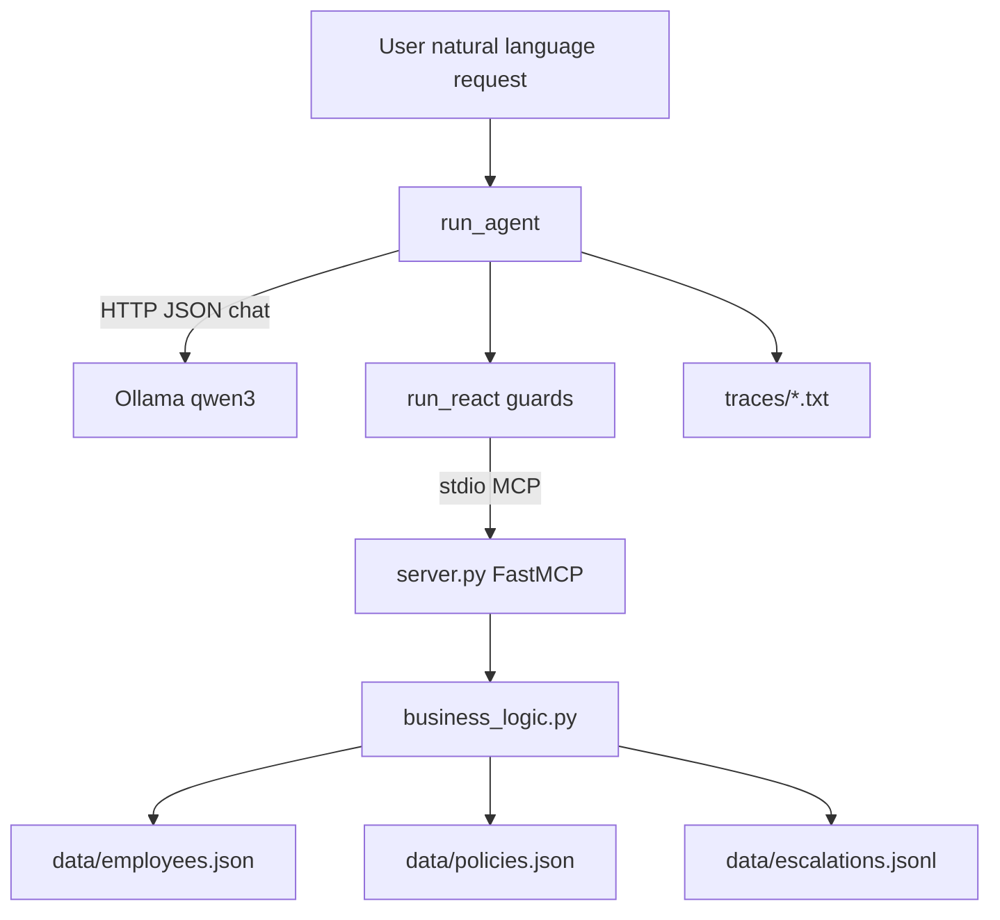
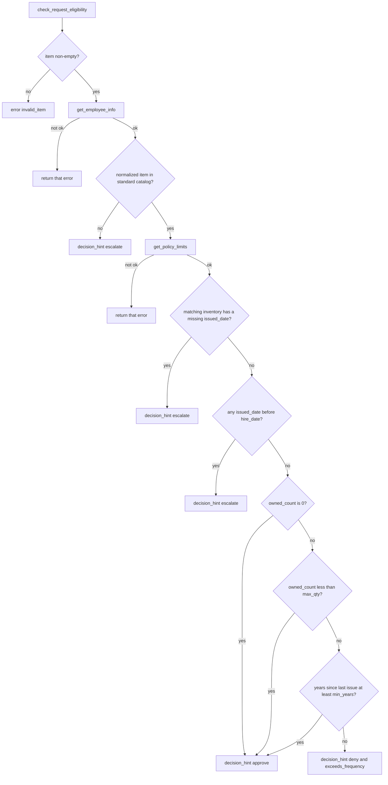

# Architecture — IT Equipment MCP Lab

How a natural-language equipment request becomes one of `approve`, `deny`, or `escalate`, and which file owns each step.

Policy rules live in [`docs/requirements.md`](requirements.md). This document is the runtime: data, pure functions, the MCP server, and the agent loop.

---

## 1. Big picture

The system answers one question:

> Given a natural-language equipment request, should IT **approve**, **deny**, or **escalate**?

Four layers stay separate:

| Layer | Files | Job |
|---|---|---|
| Policy data | `data/employees.json`, `data/policies.json` | Mock DB: who owns what, role limits |
| Pure logic | `business_logic.py` | Deterministic eligibility and `evaluate_request`. No MCP, no LLM |
| MCP server | `server.py` | Expose those functions as tools over **stdio** |
| Agent host | `agent.py`, `prompts.py`, `llm.py` | Extract who/what/why, call tools, copy the tool decision |



`evaluate_request` is the only component allowed to turn inventory and a reason into `{decision, rule}`. The model extracts fields and chooses the next tool. The host refuses a finish or a flag that disagrees with that tool.

---

## 2. Repository map

```
w7_mcp/
  docs/
    requirements.md          # schema, limits, escalate rules, fixtures
    architecture.md          # this file
    submission_assets/       # handshake / CI screenshots for the PDF packet
  data/
    employees.json           # EMP-101…105 (EMP-999 is absent on purpose)
    policies.json            # role × item {max_qty, min_years}
    escalations.jsonl        # append-only side effect of flag_for_human_review
  business_logic.py          # plain functions
  test_business_logic.py     # pytest for the policy math
  server.py                  # FastMCP stdio server
  test_client.py             # handshake client; --all-tools smokes every tool
  examples/                  # one-tool ping server and client
  agent.py                   # run_agent host + run_react loop
  test_agent.py              # scripted model; no Ollama, no server
  prompts.py                 # system prompt and reflection prompt
  llm.py                     # Ollama /api/chat
  run_scenarios.py           # live graded runs; writes traces/scenarios/
  score_traces.py            # 4/4 check of those traces
  test_score.py
  assemble_submission.py     # Markdown + PDF packet
  pyproject.toml             # Ruff and mypy settings
  .github/workflows/ci.yml   # ruff, mypy, pytest; no Ollama
```

---

## 3. Data layer

### 3.1 Employees (`data/employees.json`)

Keyed by `EMP-###`. Each record has `employee_id`, `name`, `role`, `hire_date`, and `inventory[]` of `{item, issued_date, asset_tag}`.

Age math uses a fixed clock, `REFERENCE_TODAY = 2026-10-02` in `business_logic.py`.

| ID | Role | Inventory that matters | Graded outcome |
|---|---|---|---|
| EMP-101 | Engineering | laptop issued 2022-09-01 | approve, `within_policy` |
| EMP-102 | Sales | laptop issued 2026-04-01 | deny, `exceeds_frequency` |
| EMP-103 | Engineering | laptop issued 2025-10-01 | escalate when the reason has an exceptional phrase |
| EMP-104 | Management | one monitor, 2024-10-01 | quantity cases; also the non-standard scenario |
| EMP-105 | Engineering | laptop with no `issued_date` | escalate, `missing_tenure` |
| EMP-999 | — | not in the file | `employee_not_found` |

### 3.2 Policies (`data/policies.json`)

- `standard_items`: `laptop`, `monitor`, `ergonomic_chair`
- `roles.<Role>.<item>` → `{max_qty, min_years}`

An item outside `standard_items` never reaches the year math. `evaluate_request` returns `non_standard_item`.

### 3.3 Escalation queue

`flag_for_human_review` does two writes:

1. Append to the in-memory `ESCALATION_QUEUE` for this process.
2. Append one JSON line to `data/escalations.jsonl`.

The returned dict is `{ok, flagged, queue_size, entry, message}`. `entry` holds `timestamp`, `employee_id`, `request`, and `reason`.

`clear_escalation_queue(truncate_file=True)` resets both. `run_scenarios.py` calls it before every case so one escalate cannot leak into the next.

---

## 4. Business logic (`business_logic.py`)

No MCP imports. Pytest calls these functions directly. `server.py` is a thin wrapper over the same functions.

### 4.1 Function surface

| Function | Input | What it returns |
|---|---|---|
| `get_employee_info` | `employee_id` | role, hire date, inventory, or `{ok: false, error}` |
| `find_employee` | `name`, optional `role` | `EMP-###`, or an ambiguity / not-found error |
| `get_policy_limits` | `role` | per-item `{max_qty, min_years}` |
| `check_request_eligibility` | `employee_id`, `item` | hints only. Does not read the free-text reason |
| `evaluate_request` | `employee_id`, `item`, `reason` | `{decision, rule}` the agent must copy |
| `flag_for_human_review` | `employee_id`, `request`, `reason` | queue confirmation |

### 4.2 `check_request_eligibility`, in order



Item keys are normalized (`standing desk` and `standing_desk` are the same key). A frequency miss sets `decision_hint=deny` and `exceeds_frequency=true`. This function does not look at damage phrases.

### 4.3 `evaluate_request`, in order

```text
evaluate_request(employee_id, item, reason)
  1. Empty reason → error invalid_reason
  2. eligibility = check_request_eligibility(employee_id, item)
  3. eligibility not ok → decision=escalate, rule=<error code>
  4. decision_hint approve → decision=approve, rule=within_policy
  5. decision_hint escalate
       catalog miss → rule=non_standard_item
       bad or missing issued_date → rule=missing_tenure
       otherwise → rule=ambiguous_eligibility
  6. exceeds_frequency and reason contains an exceptional phrase
       → decision=escalate, rule=early_refresh_exceptional
  7. otherwise → decision=deny, rule=exceeds_frequency
```

Exceptional phrases, case-insensitive substring match (`EXCEPTIONAL_PHRASES`):

`damaged`, `crushed`, `stolen`, `broken screen`, `client site`

| rule | decision | When |
|---|---|---|
| `within_policy` | approve | Standard item, known employee, inside quantity and frequency |
| `exceeds_frequency` | deny | Too soon, and the reason has no exceptional phrase |
| `early_refresh_exceptional` | escalate | Too soon, and the reason has an exceptional phrase |
| `non_standard_item` | escalate | Item is outside the catalog |
| `missing_tenure` | escalate | Issue date missing or in conflict with hire date |
| `employee_not_found` | escalate | Lookup failed. Also other error codes from the lookup |

Steps 4–7 are the whole policy. The agent is required to copy `decision`. It does not re-check years or scan the reason for those phrases.

### 4.4 Why eligibility and evaluate are separate

Eligibility is inventory and policy math, with no free text, so the quantity and date tests stay small. Evaluate adds the phrase list and returns the one `decision` the loop is allowed to finish with.

---

## 5. MCP server (`server.py`)

### 5.1 Transport

- Framework: FastMCP (`mcp.server.fastmcp`)
- Server name: `IT-Equipment-Server`
- Transport: **stdio**. The parent process spawns `python server.py` and speaks JSON-RPC on stdin and stdout.

There is no HTTP tool API. `run_agent` and `test_client.py` are the clients.

### 5.2 Tools

Each `@mcp.tool()` calls the matching `business_logic` function and returns its dict. FastMCP publishes an `inputSchema` from the Python signature. `run_react` validates arguments against that schema before the call.

| MCP tool | Wraps | Required arguments |
|---|---|---|
| `get_employee_info` | `bl.get_employee_info` | `employee_id` |
| `find_employee` | `bl.find_employee` | `name`; `role` optional |
| `get_policy_limits` | `bl.get_policy_limits` | `role` |
| `check_request_eligibility` | `bl.check_request_eligibility` | `employee_id`, `item` |
| `evaluate_request` | `bl.evaluate_request` | `employee_id`, `item`, `reason` |
| `flag_for_human_review` | `bl.flag_for_human_review` | `employee_id`, `request`, `reason` |

`check_request_eligibility` is an optional diagnostic. The graded path calls `evaluate_request`, which runs eligibility internally and then applies the phrase rule.

### 5.3 Handshake (`test_client.py`)

```text
spawn server.py on stdio
  → session.initialize()
  → list_tools()
  → call_tool(get_employee_info, EMP-101)
  → with --all-tools, call the other five tools once
```

This proves the server is up before any model is involved. `examples/minimal_client.py` is the smaller one-tool version of the same proof.

---

## 6. Agent

Three files:

| File | Owns |
|---|---|
| `llm.py` | `POST {OLLAMA_HOST}/api/chat`. Default model `qwen3:8b` with `think: false`. Temperature defaults to `0.0`. `format="json"` asks Ollama for one JSON object |
| `prompts.py` | System rules plus the live tool list. Reflection prompt |
| `agent.py` | Pydantic step models, `run_react`, `run_agent`, trace writer |

`OLLAMA_HOST`, `OLLAMA_MODEL`, `OLLAMA_TIMEOUT_S`, and `AGENT_MAX_STEPS` (default 8) come from the environment.

Temperature is `0.0` on both the loop and the reflection pass. A bad step is corrected by the next observation, so sampling is unused.

### 6.1 Two functions

`run_react(request, tools, complete, call_tool)` is the loop. It does not open a socket and does not import Ollama.

- `complete(prompt) -> str` returns one model reply. In production that is `llm.chat`. In `test_agent.py` it is a list of canned JSON strings.
- `call_tool(name, args) -> str` performs a call the host has already accepted. In production that is `session.call_tool`. In tests it returns canned JSON.

`run_agent` is the host around that loop:

```text
1. Spawn server.py on stdio and session.initialize()
2. list_tools()
3. If the prompt contains EMP-###, remember it as the locked id
4. complete() = system prompt + the step prompt, temperature 0.0, format json
5. call_tool() = session.call_tool, text extracted from the MCP result
6. run_react(...)  → trace lines, including a Final Decision when the loop accepts one
7. Optional inject_draft replaces the draft text used for reflection
8. Reflection pass, then the decision lock
9. Write traces/<file>.txt and return {decision, reason, tools_called, policy_decision, policy_rule, ...}
```

The loop does not keep a growing chat transcript. Each turn rebuilds one user prompt from the request, the trace so far, the calls already completed, and the steps remaining. The system prompt is attached by `complete`.

### 6.2 One model step, in order

The model must return one JSON object:

```json
{"thought": "...", "action": "evaluate_request",
 "action_input": {"employee_id": "EMP-101", "item": "laptop", "reason": "..."},
 "decision": null, "reason": null}
```

Finish is the same object with `"action": "finish"`, `"action_input": {}`, and a `decision` plus `reason`.

`parse_step` then does this:

1. Extract a JSON object. Surrounding prose is tolerated; a non-object becomes the observation `Reply was not a JSON object.`
2. If `action` is anything other than `finish` and `decision` is set, set `decision` to null and validate again. A decision on a tool call is dropped. It does not finish the loop.
3. Validate `AgentStep`. Failure becomes `Observation: Schema rejected: ...` and the step counter still advances. The loop does not escalate on the first bad reply.

| Field | Rule |
|---|---|
| `thought` | The model's own reasoning for this turn: what the request asks, what the trace shows, and which fact is still missing. A stock phrase is not enough |
| `action` | Tool name, or `finish` |
| `action_input` | Object. A JSON string is parsed. Omitted means `{}` |
| `decision` | `approve`, `deny`, or `escalate` when `action` is `finish`. Otherwise null |
| `reason` | Non-empty when `action` is `finish`. Otherwise ignored |

`EvaluateResult` (`decision`, `rule`, optional `ok`, extra fields allowed) reads an `evaluate_request` payload. `FlagResult` (`ok`, `flagged`, extra fields allowed) reads a flag payload. `ReflectionReply` is `is_valid`, `critique`, and `action` (`PROCEED`, `DENY`, or `ESCALATE`).

### 6.3 What happens after a valid step

For `action: finish`:

1. `evaluate_request` must already be in the trace. Otherwise the observation is `evaluate_request is not in the trace. Call it before finish.`
2. `decision` must equal that tool's `decision`. Otherwise the observation tells the model to finish with the tool value.
3. If the tool said `escalate`, a successful flag must already be in the trace. Otherwise the observation is `escalate requires flag_for_human_review before finish.`
4. When all three pass, the loop writes `Final Decision:` and `Reason:` and returns. It does not call the model again for that request.

For a tool name, checks run in this order. The first failure writes an observation and does not call the server:

1. Unknown name → `Unknown tool: <name>`.
2. Locked `EMP-###` and the tool is `find_employee` → `Blocked find_employee: ...`. The prompt id wins over a name lookup.
3. Locked id, and `employee_id` is present but different → rewrite the argument, log `[HOST] Rewrote employee_id → EMP-###`.
4. Arguments fail the tool's live `inputSchema` (`jsonschema`) → `Schema rejected: ...`.
5. Tool is `flag_for_human_review` and `evaluate_request` has not returned → ask for that tool first.
6. Tool is `flag_for_human_review` and the decision is `approve` or `deny` → `Do not call flag_for_human_review. Finish with <decision>.`
7. Same tool and same arguments already returned → `Already called with these arguments.`

A call that passes all seven is sent. The observation is then checked:

- `ok: false` skips the strict shape check. If the payload still contains a `decision`, that decision becomes the policy result. Lookup failures from `evaluate_request` do this: they return `decision=escalate` and an error rule.
- `evaluate_request` must match `EvaluateResult`. `flag_for_human_review` must match `FlagResult` with `flagged: true` to count as stored.
- A shape miss is appended as a `Schema rejected:` line. The payload stays in the trace.

After a usable `evaluate_request`, the trace records the tool result as a fact: `evaluate_request returned approve (rule=within_policy).` It does not name the next action. The next thought chooses flag or finish. The host still refuses a flag on approve or deny, and a finish that disagrees with the tool.

### 6.4 Step budget

`AGENT_MAX_STEPS` counts model replies, including rejected ones. When the budget ends, `run_react` stops calling the model and finishes from the tool result:

| State at the budget | What the host does |
|---|---|
| `evaluate_request` said `escalate`, and no successful flag | Call `flag_for_human_review` once. Reason is `evaluate_request rule=<rule>`. Then `Final Decision: escalate` |
| `evaluate_request` said `approve` or `deny` | `Final Decision:` is that decision. Reason is the rule. No flag |
| `evaluate_request` said `escalate` and the flag already landed | `Final Decision: escalate` |
| No `evaluate_request` in the trace | `Final Decision: escalate`. Reason says the budget ended with no tool result |

### 6.5 Reflection and the decision lock

Reflection runs only after the loop has a decision, and only when reflection is enabled (the default). It is a checkpoint before the host treats the draft as final. The review asks whether the draft satisfies the request, whether the tool evidence supports it, and whether anything is ambiguous or missing.

1. The draft is `Final Decision` plus `Reason` from the loop. `--inject-draft` can replace that text. The demo string `Final Decision: deny` still parses. A JSON draft parses too.
2. `run_reflection` sends `REFLECTION_PROMPT` with the user request, that draft, and the tool observations. The call uses `format=json` and temperature `0.0`.
3. The reply is `{"is_valid", "critique", "action"}`. `action` is `PROCEED`, `DENY`, or `ESCALATE`. `is_valid` is true only for `PROCEED`. A bad reply leaves the loop decision in place. An older `decision`/`reason` object is still accepted.
4. `PROCEED` keeps a draft that matches `evaluate_request`. `DENY` saves deny and does not flag, and only when the tool said deny. `ESCALATE` calls `flag_for_human_review` when that tool is not already in the trace, then saves escalate. That sticks when the tool said escalate, or when the trace has no tool decision.
5. Any other action snaps back to `evaluate_request.decision`. Reflection cannot approve a denial, and it cannot deny an escalation. A borderline interval stays deny. If the saved reason omits the rule id, the host appends it.

The lock is what makes `traces/scenarios/00_reflection_correction.txt` end at `approve` when the injected draft said `deny`.

### 6.6 Trace file

`_save_trace` writes a header (`prompt`, `model`, `host`, `decision`, `draft_decision`, `policy_decision`, `policy_rule`, `reflection`, optional `scenario`) and then the body.

Body lines the scorer and the tests understand:

```text
Request: EMP-101: ...
Thought: ...
Action: evaluate_request {"employee_id": "EMP-101", "item": "laptop", "reason": "..."}
Observation:
{ ... pretty JSON ... }
[ROUTE] evaluate_request returned approve (rule=within_policy).
Action: finish {}
Final Decision: approve
Reason: within_policy ...
=== Reflection ===
{ "is_valid": true, "critique": "...", "action": "PROCEED" }
Final Decision: approve
Reason: ...
```

`score_traces.py` keeps the last line that starts with `Final Decision:`. A `Draft Final Decision:` line does not count.

Ad-hoc runs go to `traces/<timestamp>_<slug>.txt`. Graded runs go to `traces/scenarios/0x_*.txt`.

---

## 7. Walks

Each walk is the graded prompt, then the tool result the host will enforce. The model may call `get_employee_info` first. It may not finish on a different decision, and it may not flag an approve or a deny.

### 7.1 Approve — EMP-101

Prompt: laptop about four years old, slowing down.

`evaluate_request(EMP-101, laptop, <reason>)` → `approve` / `within_policy`. The laptop was issued 2022-09-01. About 4.08 years is at least the Engineering minimum of 3. "Slowing down" is not an exceptional phrase, and the request is not early, so the phrase list is not consulted.

Host behavior on the turns that follow:

- `[ROUTE]` records `approve` and `within_policy`. It does not name the next action.
- A `flag_for_human_review` call is refused. The tool is not invoked.
- `finish` with `deny` or `escalate` is refused. The observation says to finish `approve`.
- `finish` with `approve` is accepted.
- Reflection may restate the reason. If it changes the decision, the lock restores `approve`.

### 7.2 Deny — EMP-102

Prompt: Sales laptop about six months old, feels slow, no damage.

`evaluate_request` → `deny` / `exceeds_frequency`. Issued 2026-04-01, Sales interval is 4 years, and the reason has no exceptional phrase. "Slow" alone does not escalate.

The flag tool is refused. Finish must be `deny`.

### 7.3 Escalate — early refresh, EMP-103

Prompt: laptop about a year old, crushed on a client site, stolen bag, broken screen.

`evaluate_request` → `escalate` / `early_refresh_exceptional`. Eligibility would have been a deny (`exceeds_frequency`). Evaluate upgrades it because the reason contains `crushed`, `stolen`, `broken screen`, and `client site`.

Turns the host will force if the model skips ahead:

1. `finish` with `escalate` before a flag → `escalate requires flag_for_human_review before finish.` The server is not called.
2. `flag_for_human_review(EMP-103, laptop, <reason>)` is sent. The queue and `escalations.jsonl` grow.
3. `finish` with `escalate` is then accepted.

If the model never flags and the step budget ends, the host sends one flag whose reason is `evaluate_request rule=early_refresh_exceptional`, then finishes `escalate`.

### 7.4 Escalate — non-standard item, EMP-104

Prompt: ergonomic split keyboard or standing desk.

`evaluate_request` → `escalate` / `non_standard_item`. The same flag-then-finish sequence as 7.3 applies. The rule id in the flag reason and in the final reason is `non_standard_item`.

### 7.5 What the four prompts return

| Prompt | `evaluate_request` |
|---|---|
| EMP-101 laptop, slowing down | `approve` / `within_policy` |
| EMP-102 laptop, slow, no damage | `deny` / `exceeds_frequency` |
| EMP-103 laptop, broken screen / crushed | `escalate` / `early_refresh_exceptional` |
| EMP-104 standing desk or split keyboard | `escalate` / `non_standard_item` |

---

## 8. How the pieces are checked

### 8.1 Without a model

| Command | What it proves |
|---|---|
| `pytest test_business_logic.py` | Date math, phrase upgrade, flag queue, missing employees |
| `pytest test_agent.py` | `run_react` with a scripted `complete`: approve with no flag, flag-before-evaluate refused, finish-before-flag refused, wrong finish refused, unknown tool, bad JSON, duplicate call, missing `inputSchema` field, budget flag |
| `pytest test_score.py` | Last `Final Decision:` in `traces/scenarios/01`–`04` is approve, deny, escalate, escalate. One miss fails |
| `ruff check .` and `mypy` | Style on the tree. Types on `agent.py`, `llm.py`, `prompts.py`, `score_traces.py` |

CI (`.github/workflows/ci.yml`) installs `requirements.txt` plus Ruff and mypy, then runs those four. It does not start Ollama and it does not spawn the MCP server.

### 8.2 With the server, still without a model

`python test_client.py` and `python examples/minimal_client.py` spawn the stdio server and call tools.

### 8.3 With Ollama

`python agent.py "<request>"` runs one prompt. `python run_scenarios.py` clears the escalation queue, runs the reflection-correction demo, then the four graded prompts. Each case retries up to three times with a hint if the decision or the required tools are wrong. Traces land in `traces/scenarios/`.

`python assemble_submission.py --pdf` stitches requirements, handshake evidence, server code, tests, agent code, the four traces, the reflection log, and CI evidence into `submission/IT_Equipment_MCP_Submission.md`.

---

## 9. Who is allowed to decide what

| Concern | Owner | What the others do |
|---|---|---|
| Role on file | `get_employee_info` | A claimed department is only a hint to `find_employee` |
| Years and quantity | `check_request_eligibility` | The model does not invent issue dates |
| Phrase match and final decision | `evaluate_request` | The model copies `decision` and `rule` |
| Storing an escalation | `flag_for_human_review` | The host sends it only after `decision=escalate`, or once at the step budget if the model never did |
| Which tool to call next | The model, inside `AgentStep` | The host drops illegal calls before they reach the server |
| Draft before it is final | Reflection | Asks whether the draft satisfies the request and whether the evidence supports it. The decision lock restores `evaluate_request.decision` if that review changes it |
| Employee id in the prompt | `run_react` EMP lock | `find_employee` is blocked and a conflicting `employee_id` argument is rewritten |

---

## 10. One-screen path

```text
natural language
    │
    ▼
run_agent ──stdio──► server.py ──► business_logic.evaluate_request ──► data/*.json
    │                                      │
    │                                      ▼
    │                               {decision, rule}
    ▼
run_react
    refuse bad JSON, bad arguments, early flags, wrong finishes
    accept finish only when it copies decision
    on escalate, require flag_for_human_review first
    │
    ▼
reflection checkpoint: PROCEED, DENY, or ESCALATE
    │
    ▼
decision lock → traces/ + approve | deny | escalate
```

MCP carries the tool call. `business_logic` decides. The loop copies that decision and refuses anything else.
